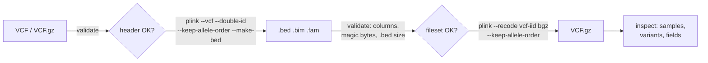

# VCF-PLINK Converter

[](https://github.com/dsugurtuna/vcf-plink-converter/actions/workflows/ci.yml)

Convert between VCF and PLINK binary filesets with PLINK 1.9 without losing sample IDs or reference alleles, and check files structurally before and after.

> **Portfolio project.** Demonstrates generalised format conversion workflows. No real genomic data is included.

## The problem

Moving genotypes between VCF (what sequencing and imputation tools write) and PLINK `.bed/.bim/.fam` (what much of GWAS tooling reads) looks like one command, but PLINK 1.9's defaults quietly change data: sample IDs are split at an underscore on import, joined with one on export, and the major allele can end up as REF. A truncated `.bed` file is not detected until something downstream fails.

## What this does

- **VCF to PLINK** with `--double-id` (keep the whole sample ID) and `--keep-allele-order`.
- **PLINK to VCF** with `--recode vcf-iid` (sample names are IIDs, not `FID_IID`), `--keep-allele-order`, and block-gzipped output when the name ends in `.vcf.gz`.
- **Validation.** VCF: `##fileformat=VCF` first and a `#CHROM` line with the eight mandatory columns. PLINK: all three files present, six columns in `.bim` and `.fam`, SNP-major magic bytes, and a `.bed` size of exactly `3 + variants x ceil(samples / 4)` bytes.
- **Inspection.** Sample names and count, variant count, contigs, INFO and FORMAT fields, for plain or gzipped VCF.

## Quickstart

Inspection and validation run on the synthetic files in [`examples/`](examples/README.md) without PLINK.

```bash
git clone https://github.com/dsugurtuna/vcf-plink-converter.git
cd vcf-plink-converter
python3.11 -m venv .venv && source .venv/bin/activate
pip install -e ".[dev]"
pytest

python -m vcf_converter inspect examples/demo.vcf
python -m vcf_converter validate examples/demo.vcf examples/demo examples/truncated
```

The second command exits with 1 and reports the planted problem:

```text
INVALID  .bed is 6 bytes; 2 variants x 5 samples needs 7: examples/truncated.bed
6 checks passed, 1 problems
```

Conversion needs PLINK 1.9 on the `PATH` (or `--plink /path/to/plink`):

```bash
python -m vcf_converter vcf-to-plink examples/demo.vcf /tmp/demo
python -m vcf_converter plink-to-vcf /tmp/demo /tmp/demo_roundtrip.vcf.gz
```

I ran this round trip with PLINK v1.90b7.2 (11 Dec 2023): the `.fam` keeps `SYN_01` as both FID and IID, the `.bed` PLINK writes is byte-identical to `examples/demo.bed`, and the returned VCF has the original sample names, REF/ALT and genotypes (PLINK adds an `INFO` flag `PR` to say REF was not checked against a reference genome). With PLINK's defaults instead (`plink --vcf examples/demo.vcf --make-bed`), `SYN_01` becomes FID `SYN` and IID `01`.

From Python:

```python
from vcf_converter import FileValidator, VCFInspector

info = VCFInspector().inspect("examples/demo.vcf")
print(info.sample_names, info.variant_count)
print(FileValidator().validate_plink_binary("examples/truncated").invalid)
```

## How it works



## Design decisions

- **Override PLINK's ID handling both ways.** `--double-id` on import and `vcf-iid` on export make sample names survive a round trip. Without them, `SYN_01` becomes FID `SYN` and IID `01`, then `SYN_01` again only by luck.
- **Keep allele order.** PLINK 1.9 otherwise may make the major allele A2 and writes A2 as REF, so REF in the output VCF may not match the reference genome.
- **Check the `.bed` size, not just its first bytes.** The size is fully determined by the `.bim` and `.fam` row counts, so one comparison catches truncation and mismatched filesets.
- **Validation and inspection need no external tools,** so they can run as a gate anywhere, including CI.
- **PLINK is called through an injectable runner,** so command lines and failure handling are tested without PLINK installed.

## Limitations and what it is not

- PLINK 1.9 handles biallelic variants only; multi-allelic sites need splitting (for example `bcftools norm -m-`) before import.
- REF is preserved only if it was right to begin with. To force REF from a reference genome, use PLINK's `--a2-allele` with a reference file; this tool does not do that for you.
- Validation is structural. It does not check that genotypes are plausible or that positions match a genome build.
- Phase, dosages and FORMAT fields other than GT are lost in the PLINK 1 binary format.

## Where this fits

Used before [gwas-data-preparation](https://github.com/dsugurtuna/gwas-data-preparation) (which has a simpler converter of its own) and [hla-pipeline-manager](https://github.com/dsugurtuna/hla-pipeline-manager); sample QC is in [genomic-qc-toolkit](https://github.com/dsugurtuna/genomic-qc-toolkit).

## Roadmap

- Optional `--a2-allele` step to set REF from a reference VCF.
- Check chromosome naming (`1` versus `chr1`) against a target build.
- Record input and output checksums for each conversion.

## Licence

MIT is declared in `pyproject.toml`, but no licence file is included yet.

---

Personal project by [Ugur Tuna](https://github.com/dsugurtuna). Not affiliated with or endorsed by any employer.
